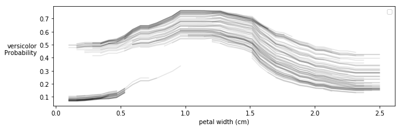

# Scenarion

## Table of Contents
1. [Package Description](#description)
1. [Features](#features) - What can Scenarion do?
1. [Requirements](#requirements) - When can you use Scenarion?
1. [Classification Example](#example)
1. [Other examples](#other_examples)


## Package Description <a name='description'></a>
Scenarion helps interperate models by using scenario testing. Scenario testing allows you to see nontrivial relationships between features and the variables they're meant to predict.

## Features: <a name='features'></a>
* Standard use is just one additional line of code.
* Plots non-linear relationships
* Plots interacting/non-separable relationships
* Works for regression and classification models
* Works for both continuous and (one-hot-encoded) categorical inputs
* Detects out-of-sample scenarios and reveals the corresponding model behavoir.
* Model agnostic. Scenarion doesn't care if your model uses a random forest, neural nets, or tarot cards as long as it makes predictions.


## Requirements: <a name='requirements'></a>
#### In general:
* A trained model.
* Data to use to generate scenarios (the original training data works well).

**Note:** Even if your model doesn't have exactly the methods/classes listed below, you may still be able to use Scenarion after quickly wrapping your model as is done in example_football_keras.ipynb.

#### For classification models:
A trained model that has a `.predict_proba` method and a `.classes_` attribute, similiar to models produced by SKLearn.

#### For regression models:
A trained model that has a `.predict` method.

# Classification Example <a name='example'></a>
Let's look at the standard iris data set.


```python
import scenarion
import pandas as pd
from sklearn.datasets import load_iris
from sklearn.ensemble import ExtraTreesClassifier
```

## Load and Prep the data


```python
# Load the data
data = load_iris()

# Move the data into a pandas DataFrame
df = pd.DataFrame(data=data['data'], columns=data['feature_names'])

df['species'] = data['target']
df.species.replace({i:species for i, species in enumerate(data['target_names'])}, inplace=True)

# view a sample of the DataFrame
df.sample(4)
```


<div>
<style scoped>
    .dataframe tbody tr th:only-of-type {
        vertical-align: middle;
    }

    .dataframe tbody tr th {
        vertical-align: top;
    }

    .dataframe thead th {
        text-align: right;
    }
</style>
<table border="1" class="dataframe">
  <thead>
    <tr style="text-align: right;">
      <th></th>
      <th>sepal length (cm)</th>
      <th>sepal width (cm)</th>
      <th>petal length (cm)</th>
      <th>petal width (cm)</th>
      <th>species</th>
    </tr>
  </thead>
  <tbody>
    <tr>
      <th>129</th>
      <td>7.2</td>
      <td>3.0</td>
      <td>5.8</td>
      <td>1.6</td>
      <td>virginica</td>
    </tr>
    <tr>
      <th>95</th>
      <td>5.7</td>
      <td>3.0</td>
      <td>4.2</td>
      <td>1.2</td>
      <td>versicolor</td>
    </tr>
    <tr>
      <th>47</th>
      <td>4.6</td>
      <td>3.2</td>
      <td>1.4</td>
      <td>0.2</td>
      <td>setosa</td>
    </tr>
    <tr>
      <th>45</th>
      <td>4.8</td>
      <td>3.0</td>
      <td>1.4</td>
      <td>0.3</td>
      <td>setosa</td>
    </tr>
  </tbody>
</table>
</div>


## Train a model


```python
y_col = 'species'
x_cols = [col for col in df.columns if col != y_col]

train_x = df[x_cols]
train_y = df[y_col]

model = ExtraTreesClassifier(n_estimators=100, min_samples_leaf=10)
model.fit(train_x, train_y);
```

## Use Scenarion to interpret the model


```python
col_to_test = 'petal width (cm)'
scenarios_df = scenarion.test_scenarios(model, df, 
                x_cols, feat_to_test=col_to_test, n_samples='all')
```

    Testing Scenarios: 100%|██████████| 150/150 [00:05<00:00, 26.41it/s]
    


**Fig Interpretation**
The figure above shows how the probability of a sample belonging to each species as we change a single variable. Each line represents a single sample (from `df`) that has been tested accross a range of scenarios for the variable we're testing (`col_to_test`).


Key take-aways:
1. small, medium, and large values of petal width correspond to maximal probabilities for 3 different species of Iris
2. These trends are consistent across all tested sample. That is to say that the model hasn't captured any multiple dimensional interactions in which there is one relationship between petal width and species probability for a subset of samples and a different relationship for different samples. To see an example of this see the football examples.

**Note:** You can choose to veiw only certain classes if you'd like, and you can also choose not to show the scenarios that are likely out-of-sample (not like anything the model was trained on) and therefore not as reliable. See below.


```python
col_to_test = 'petal width (cm)'
scenarios_df = scenarion.test_scenarios(model, df, 
                x_cols, feat_to_test=col_to_test, n_samples='all',
                classes_to_show=['versicolor'], hide_oos=True)
```

    Testing Scenarios: 100%|██████████| 150/150 [00:05<00:00, 27.70it/s]
    No handles with labels found to put in legend.
    





# Other Examples: <a name='other_examples'></a>
Note: depending on where you're viewing this, you may need to copy/paste the links.

* Testing **categorical features**: [example_income.ipynb](./example_income.ipynb)

* Testing a **regression model**: [example_wine.ipynb](./example_wine.ipynb)

* Testing a model that captures **multi-dimensional interactions**: [example_football_sklearn.ipynb](./example_football_sklearn.ipynb)

* Testing a model that doesn't have a `.predict` method that works as Scenarion expects: [example_football_keras.ipynb](./example_football_keras.ipynb)


```python

```
